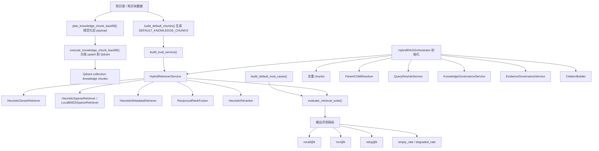
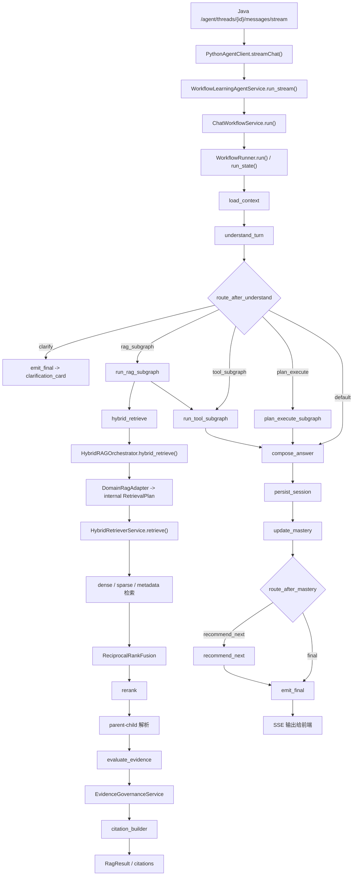

# RAG 离线与在线链路

下面这两张图按当前代码的真实实现，分别描述离线准备链路和在线问答链路。

## 离线链路

```mermaid
flowchart TD
  A["知识源 / 知识块数据"] --> B["build_default_chunks() 生成 DEFAULT_KNOWLEDGE_CHUNKS"]
  A --> C["plan_knowledge_chunk_backfill() 规范化旧 payload"]
  C --> D["execute_knowledge_chunk_backfill() 分批 upsert 到 Qdrant"]
  D --> E["Qdrant collection: knowledge chunks"]

  B --> F["build_eval_service()"]
  F --> G["HybridRetrieverService"]
  G --> H["HeuristicDenseRetriever"]
  G --> I["HeuristicSparseRetriever / LocalBM25SparseRetriever"]
  G --> J["HeuristicMetadataRetriever"]
  G --> K["ReciprocalRankFusion"]
  G --> L["HeuristicReranker"]

  M["build_default_eval_cases()"] --> N["evaluate_retrieval_suite()"]
  G --> N
  N --> O["输出评测指标"]
  O --> P["recall@k"]
  O --> Q["mrr@k"]
  O --> R["ndcg@k"]
  O --> S["empty_rate / degraded_rate"]

  T["HybridRAGOrchestrator 初始化"] --> U["去重 chunks"]
  T --> V["ParentChildResolver"]
  T --> W["QueryRewriteService"]
  T --> X["KnowledgeGovernanceService"]
  T --> Y["EvidenceGovernanceService"]
  T --> Z["CitationBuilder"]
  T --> G
```

## 在线链路

```mermaid
flowchart TD
  A["Java /agent/threads/{id}/messages/stream"] --> B["PythonAgentClient.streamChat()"]
  B --> C["WorkflowLearningAgentService.run_stream()"]
  C --> D["ChatWorkflowService.run()"]
  D --> E["WorkflowRunner.run() / run_state()"]

  E --> F["load_context"]
  F --> G["understand_turn"]
  G --> H{"route_after_understand"}

  H -->|"clarify"| I["emit_final -> clarification_card"]
  H -->|"plan_execute"| J["plan_execute_subgraph"]
  H -->|"rag_subgraph"| K["run_rag_subgraph"]
  H -->|"tool_subgraph"| L["run_tool_subgraph"]
  H -->|"default"| M["compose_answer"]

  K --> K1["hybrid_retrieve"]
  K1 --> K2["HybridRAGOrchestrator.hybrid_retrieve()"]
  K2 --> K3["DomainRagAdapter -> internal RetrievalPlan"]
  K3 --> K4["HybridRetrieverService.retrieve()"]
  K4 --> K5["dense / sparse / metadata 检索"]
  K5 --> K6["ReciprocalRankFusion"]
  K6 --> K7["rerank"]
  K7 --> K8["parent-child 解析"]
  K8 --> K9["evaluate_evidence"]
  K9 --> K10["EvidenceGovernanceService"]
  K10 --> K11["citation_builder"]
  K11 --> K12["RagResult / citations"]

  J --> M
  L --> M
  K --> L

  M --> N["persist_session"]
  N --> O["update_mastery"]
  O --> P{"route_after_mastery"}
  P -->|"recommend_next"| Q["recommend_next"]
  P -->|"final"| R["emit_final"]
  Q --> R
  R --> S["SSE 输出给前端"]
```

